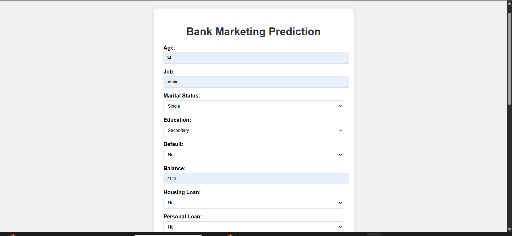
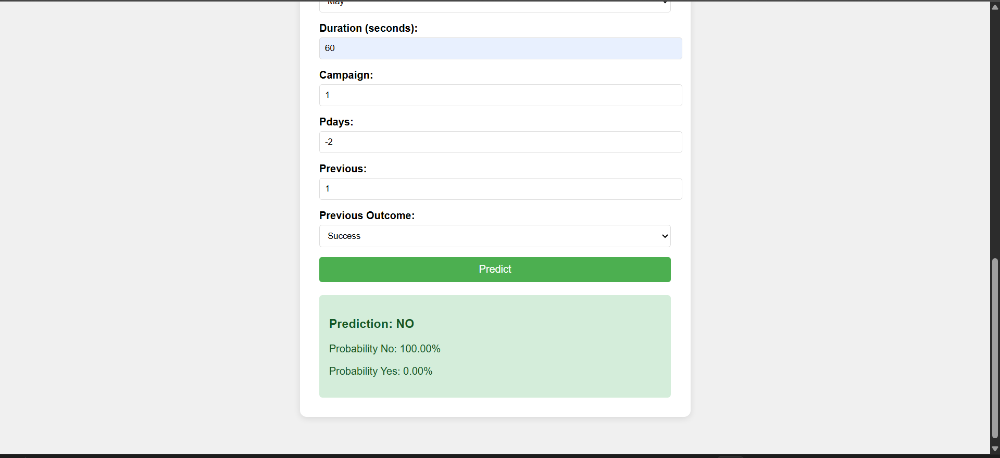
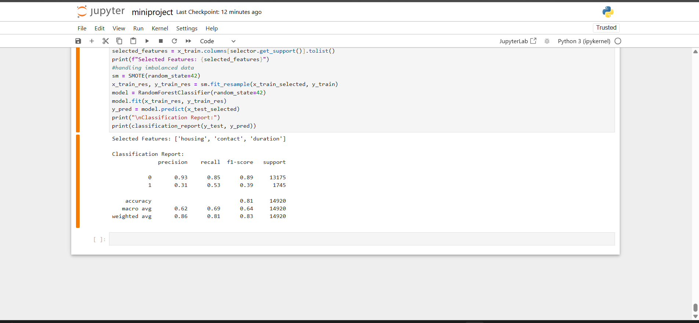

# Bank Marketing Campaign Prediction

A machine learning project to predict the outcome of marketing campaigns conducted by a Portuguese banking institution. The model predicts whether a client will subscribe to a term deposit based on various demographic and campaign-related features.

## 📋 Table of Contents
- [Overview](#overview)
- [Dataset Description](#dataset-description)
- [Features](#features)
- [Technologies Used](#technologies-used)
- [Installation](#installation)
- [Usage](#usage)
- [Model Details](#model-details)
- [Docker Setup](#docker-setup)
- [Screenshots](#screenshots)
- [Results](#results)
- [Contributing](#contributing)
- [License](#license)

## 🎯 Overview

This project aims to predict whether a bank client will subscribe to a term deposit (yes/no) based on direct marketing campaign data. The prediction model helps the bank optimize their marketing strategies by identifying potential subscribers.

**Target Variable:** Binary classification (subscribed: yes/no)

## 📊 Dataset Description

The dataset contains information about bank clients and their interactions with marketing campaigns.

### Bank Client Data:
1. **age** - Client's age (numeric)
2. **job** - Type of job (categorical: 'admin.', 'blue-collar', 'entrepreneur', 'housemaid', 'management', 'retired', 'self-employed', 'services', 'student', 'technician', 'unemployed', 'unknown')
3. **marital** - Marital status (categorical: 'divorced', 'married', 'single', 'unknown')
4. **education** - Education level (categorical: 'basic.4y', 'basic.6y', 'basic.9y', 'high.school', 'illiterate', 'professional.course', 'university.degree', 'unknown')
5. **default** - Has credit in default? (categorical: 'no', 'yes', 'unknown')
6. **housing** - Has housing loan? (categorical: 'no', 'yes', 'unknown')
7. **loan** - Has personal loan? (categorical: 'no', 'yes', 'unknown')

### Campaign Contact Data:
8. **contact** - Contact communication type (categorical: 'cellular', 'telephone')
9. **month** - Last contact month of year (categorical: 'jan', 'feb', 'mar', ..., 'nov', 'dec')
10. **day_of_week** - Last contact day of the week (categorical: 'mon', 'tue', 'wed', 'thu', 'fri')
11. **duration** - Last contact duration in seconds (numeric)
    - ⚠️ **Note:** This attribute highly affects the output target. Duration is not known before a call is performed, so it should be discarded for realistic predictive modeling.

### Other Attributes:
12. **campaign** - Number of contacts performed during this campaign (numeric)
13. **pdays** - Number of days since client was last contacted from previous campaign (numeric; 999 = not previously contacted)
14. **previous** - Number of contacts performed before this campaign (numeric)
15. **poutcome** - Outcome of previous marketing campaign (categorical: 'failure', 'nonexistent', 'success')

### Target Variable:
- **y** - Has the client subscribed to a term deposit? (binary: 'yes', 'no')

## 🛠️ Technologies Used

- **Python** - Core programming language
- **Flask** - Web framework for API deployment
- **scikit-learn** - Machine learning library
- **pandas** - Data manipulation and analysis
- **numpy** - Numerical computing
- **imbalanced-learn** - Handling imbalanced datasets
- **Docker** - Containerization

## 📥 Installation

### Prerequisites
- Python 3.8+
- pip package manager
- Docker (optional, for containerized deployment)

### Setup

1. Clone the repository:
```bash
git clone https://github.com/yourusername/bank-marketing-prediction.git
cd bank-marketing-prediction
```

2. Create a virtual environment:
```bash
python -m venv venv
source venv/bin/activate  # On Windows: venv\Scripts\activate
```

3. Install required packages:
```bash
pip install -r requirements.txt
```

### Requirements.txt
```
flask==2.3.0
scikit-learn==1.3.0
pandas==2.0.0
numpy==1.24.0
imbalanced-learn==0.11.0
```

## 🚀 Usage

### Running the Application

1. Start the Flask application:
```bash
python app.py
```

2. The API will be available at `http://localhost:5000`

3. Make predictions using POST requests with client data

### Example API Request
```python
import requests

data = {
    "age": 35,
    "job": "management",
    "marital": "married",
    "education": "university.degree",
    # ... other features
}

response = requests.post('http://localhost:5000/predict', json=data)
print(response.json())
```

## 🧠 Model Details

### Data Preprocessing
- **Imbalanced Data Handling:** The dataset was imbalanced with fewer positive cases (subscriptions). Applied oversampling techniques using imbalanced-learn to improve model performance.
- **Feature Engineering:** Categorical variables encoded appropriately
- **Feature Selection:** Duration feature excluded from final model for realistic predictions

### Model Training
- Algorithm: used randomforestclassifier to classify results
- Cross-validation used for model evaluation
- Hyperparameter tuning performed

## 🐳 Docker Setup

The application is containerized using Docker for easy deployment.

### Build Docker Image
```bash
docker build -t bank-marketing-predictor .
```

### Run Docker Container
```bash
docker run -p 5000:5000 bank-marketing-predictor
```

### Docker Compose (optional)
```bash
docker-compose up
```

## 📸 Screenshots

### Model Performance



### Confusion Matrix



## 📈 Results

- **Accuracy:** 0.80
- **Precision:** 0.31
- **Recall:** 0.52
- **F1-Score:** 0.39
- **ROC-AUC:** 0.79


## 🤝 Contributing

Contributions are welcome! Please feel free to submit a Pull Request.

1. Fork the repository
2. Create your feature branch (`git checkout -b feature/AmazingFeature`)
3. Commit your changes (`git commit -m 'Add some AmazingFeature'`)
4. Push to the branch (`git push origin feature/AmazingFeature`)
5. Open a Pull Request

## 📝 License

This project is licensed under the MIT License - see the [LICENSE](LICENSE) file for details.

## 👥 Authors

- Sreeraj A - [Your GitHub Profile](https://github.com/yourusername)

## 🙏 Acknowledgments

- Dataset source: [UCI Machine Learning Repository - Bank Marketing Dataset](https://archive.ics.uci.edu/ml/datasets/bank+marketing)
- Portuguese Banking Institution for providing the dataset

---
